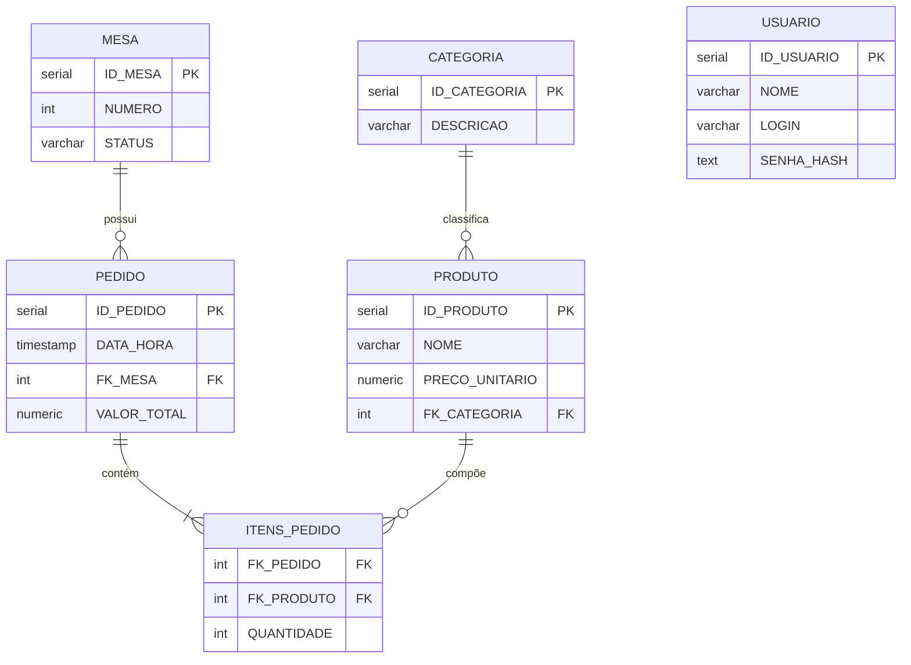

# DER — Diagrama Entidade-Relacionamento

## Legenda

| Símbolo  | Significado              |
|----------|--------------------------|
| `||`     | exatamente um            |
| `o{`     | zero ou muitos           |
| `|{`     | um ou muitos             |
| `PK`     | chave primária           |
| `FK`     | chave estrangeira        |

## Observações

- **USUARIO** não possui relacionamento com as demais entidades no modelo atual; é utilizado exclusivamente para autenticação dos operadores do sistema.
- **ITENS_PEDIDO** é uma entidade associativa (tabela de junção) que resolve o relacionamento N:N entre PEDIDO e PRODUTO, adicionando o atributo QUANTIDADE.
- A chave primária de **ITENS_PEDIDO** é composta por (FK_PEDIDO, FK_PRODUTO).
